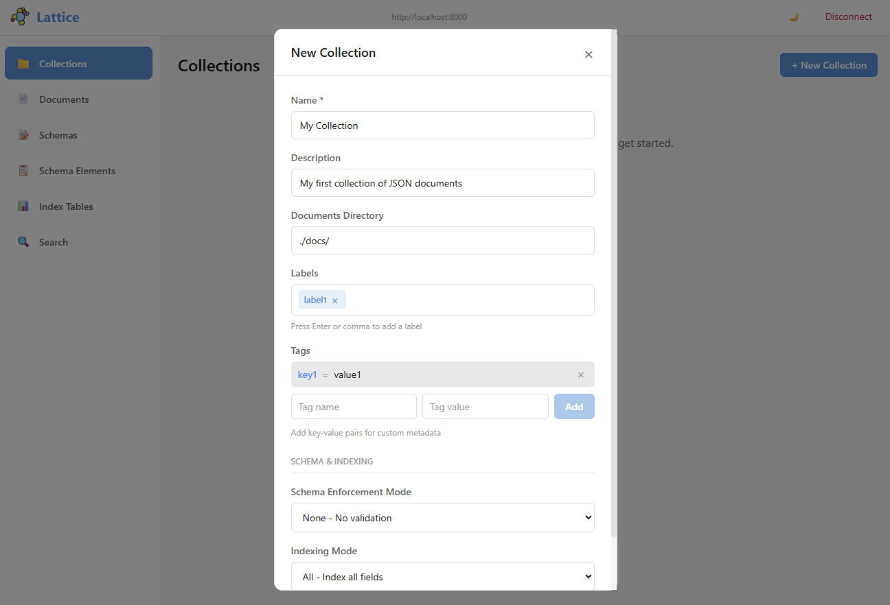
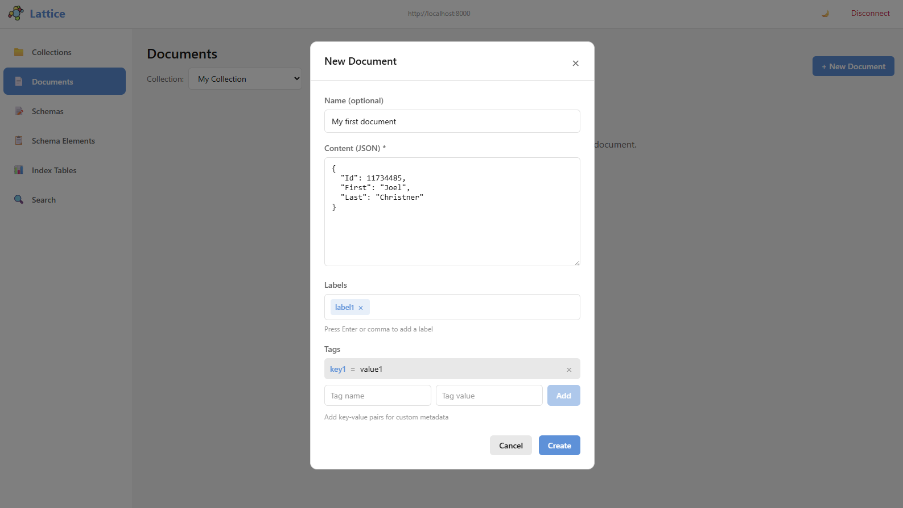
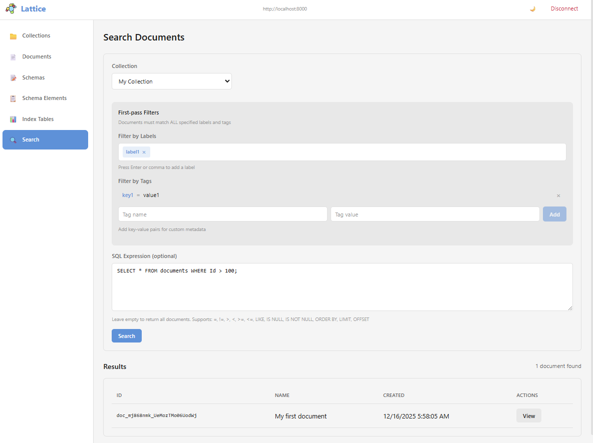

# Lattice

Lattice is a JSON document store with automatic schema detection, SQL-like querying, and flexible indexing. It supports multiple database backends including SQLite, SQL Server, PostgreSQL, and MySQL, enabling both embedded single-node deployments and horizontally scalable distributed architectures.

## Features

- **Automatic Schema Detection**: Ingest JSON documents without defining structure upfront
- **SQL-like Queries**: Familiar `WHERE field = 'value'` syntax
- **Multi-Database Support**: SQLite, SQL Server, PostgreSQL, MySQL
- **Horizontal Scaling**: Deploy multiple instances against a shared database backend
- **Automatic Indexing**: Fields indexed by default with selective override
- **Optional Schema Enforcement**: Add constraints at any time
- **REST API**: Built-in HTTP server for remote access

## Screenshots

### Creating a Collection



Create collections with custom labels, tags, schema enforcement modes, and indexing options.

### Adding a Document



Add JSON documents with optional names, labels, and key-value tags for metadata.

### Searching Documents



Search documents by labels, tags, and SQL-like expressions on data properties.

## Installation

```bash
dotnet add package Lattice.Core
```

For the REST server:
```bash
dotnet add package Lattice.Server
```

## Quick Start

### Using LatticeClient (Embedded)

#### SQLite (Default)

```csharp
using Lattice.Core;

// Default SQLite configuration
LatticeSettings settings = new LatticeSettings();
settings.Database.Type = DatabaseTypeEnum.Sqlite;
settings.Database.Filename = "lattice.db";

using LatticeClient client = new LatticeClient(settings);

// Create a collection and add documents
await client.Collection.CreateAsync("users");
await client.Document.CreateAsync("users", new { name = "Alice", email = "alice@example.com" });
```

#### SQLite In-Memory

```csharp
using Lattice.Core;

LatticeSettings settings = new LatticeSettings
{
    InMemory = true
};
settings.Database.Type = DatabaseTypeEnum.Sqlite;
settings.Database.Filename = "lattice.db";

using LatticeClient client = new LatticeClient(settings);
```

#### SQL Server

```csharp
using Lattice.Core;
using Lattice.Core.Repositories.SqlServer;

// Option 1: Using individual parameters
SqlServerRepository repo = new SqlServerRepository(
    server: "localhost",
    database: "lattice",
    username: "sa",
    password: "YourPassword123!",
    trustServerCertificate: true
);
repo.InitializeRepository();

LatticeSettings settings = new LatticeSettings();
using LatticeClient client = new LatticeClient(repo, settings);

// Option 2: Using connection string
SqlServerRepository repo = new SqlServerRepository(
    "Server=localhost;Database=lattice;User Id=sa;Password=YourPassword123!;TrustServerCertificate=true;"
);
repo.InitializeRepository();

using LatticeClient client = new LatticeClient(repo, new LatticeSettings());
```

#### PostgreSQL

```csharp
using Lattice.Core;
using Lattice.Core.Repositories.Postgresql;

// Option 1: Using individual parameters
PostgresqlRepository repo = new PostgresqlRepository(
    host: "localhost",
    database: "lattice",
    username: "postgres",
    password: "YourPassword123!",
    port: 5432
);
repo.InitializeRepository();

LatticeSettings settings = new LatticeSettings();
using LatticeClient client = new LatticeClient(repo, settings);

// Option 2: Using connection string
PostgresqlRepository repo = new PostgresqlRepository(
    "Host=localhost;Port=5432;Database=lattice;Username=postgres;Password=YourPassword123!;Pooling=true;"
);
repo.InitializeRepository();

using LatticeClient client = new LatticeClient(repo, new LatticeSettings());
```

#### MySQL

```csharp
using Lattice.Core;
using Lattice.Core.Repositories.Mysql;

// Option 1: Using individual parameters
MysqlRepository repo = new MysqlRepository(
    server: "localhost",
    database: "lattice",
    username: "root",
    password: "YourPassword123!",
    port: 3306
);
repo.InitializeRepository();

LatticeSettings settings = new LatticeSettings();
using LatticeClient client = new LatticeClient(repo, settings);

// Option 2: Using connection string
MysqlRepository repo = new MysqlRepository(
    "Server=localhost;Port=3306;Database=lattice;User=root;Password=YourPassword123!;Pooling=true;"
);
repo.InitializeRepository();

using LatticeClient client = new LatticeClient(repo, new LatticeSettings());
```

### Using Lattice.Server (REST API)

Lattice.Server loads configuration from the `lattice.json` settings file and exposes a REST API.

#### Starting the Server

```bash
# Use default settings file (lattice.json)
dotnet run --project src/Lattice.Server

# Use custom settings file
dotnet run --project src/Lattice.Server -- mysettings.json
```

#### Configuration File Examples

##### SQLite Configuration (lattice.json)

```json
{
  "Logging": {
    "ConsoleLogging": true,
    "MinimumSeverity": 1,
    "LogFilename": "lattice.log"
  },
  "Rest": {
    "Hostname": "localhost",
    "Port": 8000
  },
  "Lattice": {
    "InMemory": false,
    "DefaultDocumentsDirectory": "./documents",
    "EnableLogging": false,
    "Database": {
      "Type": "Sqlite",
      "Filename": "lattice.db"
    }
  }
}
```

##### SQL Server Configuration

```json
{
  "Logging": {
    "ConsoleLogging": true,
    "MinimumSeverity": 1,
    "LogFilename": "lattice.log"
  },
  "Rest": {
    "Hostname": "0.0.0.0",
    "Port": 8000
  },
  "Lattice": {
    "DefaultDocumentsDirectory": "./documents",
    "EnableLogging": false,
    "Database": {
      "Type": "SqlServer",
      "Hostname": "localhost",
      "Port": 1433,
      "DatabaseName": "lattice",
      "Username": "sa",
      "Password": "YourPassword123!"
    }
  }
}
```

##### PostgreSQL Configuration

```json
{
  "Logging": {
    "ConsoleLogging": true,
    "MinimumSeverity": 1,
    "LogFilename": "lattice.log"
  },
  "Rest": {
    "Hostname": "0.0.0.0",
    "Port": 8000
  },
  "Lattice": {
    "DefaultDocumentsDirectory": "./documents",
    "EnableLogging": false,
    "Database": {
      "Type": "Postgres",
      "Hostname": "localhost",
      "Port": 5432,
      "DatabaseName": "lattice",
      "Username": "postgres",
      "Password": "YourPassword123!"
    }
  }
}
```

##### MySQL Configuration

```json
{
  "Logging": {
    "ConsoleLogging": true,
    "MinimumSeverity": 1,
    "LogFilename": "lattice.log"
  },
  "Rest": {
    "Hostname": "0.0.0.0",
    "Port": 8000
  },
  "Lattice": {
    "DefaultDocumentsDirectory": "./documents",
    "EnableLogging": false,
    "Database": {
      "Type": "Mysql",
      "Hostname": "localhost",
      "Port": 3306,
      "DatabaseName": "lattice",
      "Username": "root",
      "Password": "YourPassword123!"
    }
  }
}
```

## Horizontal Scaling

With SQL Server, PostgreSQL, or MySQL backends, multiple Lattice instances can share a common database, enabling horizontal scaling:

```
                    ┌─────────────────┐
                    │  Load Balancer  │
                    └────────┬────────┘
                             │
         ┌───────────────────┼───────────────────┐
         │                   │                   │
         ▼                   ▼                   ▼
┌─────────────────┐ ┌─────────────────┐ ┌─────────────────┐
│ Lattice.Server  │ │ Lattice.Server  │ │ Lattice.Server  │
│   Instance 1    │ │   Instance 2    │ │   Instance 3    │
└────────┬────────┘ └────────┬────────┘ └────────┬────────┘
         │                   │                   │
         └───────────────────┼───────────────────┘
                             │
                             ▼
                    ┌──────────────────┐
                    │  Shared Database │
                    │  (PostgreSQL /   │
                    │   SQL Server /   │
                    │   MySQL)         │
                    └──────────────────┘
```

Each instance connects to the same database, allowing:
- **Load distribution** across multiple server instances
- **High availability** through redundant instances
- **Independent scaling** of application and database tiers

## Core Operations

### Collections

```csharp
// Create a collection
await client.Collection.CreateAsync("products");

// List collections
List<Collection> collections = await client.Collection.ListAsync();

// Delete a collection
await client.Collection.DeleteAsync("products");
```

### Documents

```csharp
// Create a document
Document doc = await client.Document.CreateAsync("products", new
{
    name = "Widget",
    price = 29.99,
    tags = new[] { "hardware", "tools" }
});

// Read a document
Document doc = await client.Document.ReadAsync("products", documentId);

// Update a document
await client.Document.UpdateAsync("products", documentId, new
{
    name = "Widget Pro",
    price = 39.99
});

// Delete a document
await client.Document.DeleteAsync("products", documentId);
```

### Searching

```csharp
// Simple query
SearchQuery query = new SearchQuery
{
    CollectionGuid = collectionGuid,
    Conditions = "name = 'Widget'"
};
SearchResult result = await client.Search.SearchAsync(query);

// Complex query with multiple conditions
SearchQuery query = new SearchQuery
{
    CollectionGuid = collectionGuid,
    Conditions = "price > 20 AND price < 50 AND category = 'electronics'"
};

// Query with pagination
SearchQuery query = new SearchQuery
{
    CollectionGuid = collectionGuid,
    Conditions = "status = 'active'",
    MaxResults = 100,
    StartIndex = 0
};
```

### Supported Query Operators

- `=` Equal
- `!=` Not equal
- `>` Greater than
- `>=` Greater than or equal
- `<` Less than
- `<=` Less than or equal
- `LIKE` Pattern matching (with `%` wildcard)
- `IS NULL` Null check
- `IS NOT NULL` Not null check

## Project Structure

```
src/
├── Lattice.Core/           # Core SDK library
│   ├── Client/             # Client-facing API
│   ├── Models/             # Data models
│   ├── Repositories/       # Database implementations
│   │   ├── Sqlite/
│   │   ├── SqlServer/
│   │   ├── Postgresql/
│   │   └── Mysql/
│   ├── Schema/             # Schema detection
│   └── Search/             # Query parsing
├── Lattice.Server/         # REST API server
├── Test.Automated/         # Integration tests
└── Test.Throughput/        # Performance tests
```

## Building and Testing

```bash
# Build the solution
dotnet build

# Run automated tests
dotnet run --project src/Test.Automated

# Run throughput tests
dotnet run --project src/Test.Throughput
```

## Docker

The fastest way to get started with Lattice is using Docker Compose, which runs both the server and dashboard:

```bash
# Start both server and dashboard
docker-compose up -d

# Access the dashboard at http://localhost:3000
# Access the API directly at http://localhost:8000
```

This starts:
- **Lattice Server** on port 8000 with SQLite storage
- **Lattice Dashboard** on port 3000 (proxies API requests to the server)

Data is persisted in Docker volumes (`lattice-data` and `lattice-documents`).

For detailed Docker configuration including external database backends, environment variables, and production deployment, see [DOCKER.md](DOCKER.md).

## Database Backend Comparison

| Feature | SQLite | SQL Server | PostgreSQL | MySQL |
|---------|:------:|:----------:|:----------:|:-----:|
| Embedded deployment | Yes | No | No | No |
| Horizontal scaling | No | Yes | Yes | Yes |
| Zero configuration | Yes | No | No | No |
| Connection pooling | Limited | Yes | Yes | Yes |
| In-memory mode | Yes | No | No | No |

## License

See LICENSE file for details.

## Attribution

Special thanks to <a href="https://www.flaticon.com/free-icons/particles" title="particles icons">Particles icons created by Aranagraphics - Flaticon</a> for the logo.
